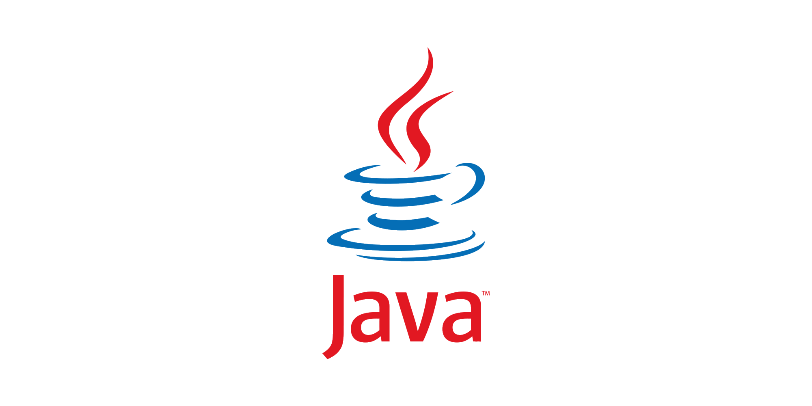
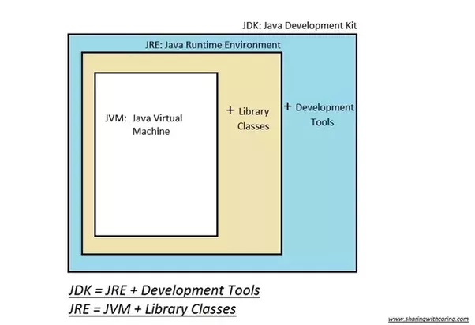

# Java 개발에 사용되는 Software Tool 소개

## Java

</img>

### Java Editions

- Java SE (Standard Edition): 개인용 개발 환경을 위한 Java
- Java EE (Enterprise Edition): 기업용 개발 환경을 위한 Java
- Java ME (Micro Edition): 임베디드 환경을 위한 Java 플랫폼

### Java Development Kit (JDK)

</img>

- Oracle JDK: Oracle에서 제공하는 유료 Java 개발 플랫폼. Oracle에서 지적 재산권을 보유한 일부 플러그인이 추가로 제공되며, Oracle로부터 사후 지원을 받을 수 있다. 비상업적인 용도의 사용은 무료로 가능하나, 상업적 용도로 전환하거나 라이센스가 만료되면 더이상 Oracle JDK로 개발한 프로그램을 사용해서는 안된다.
- OpenJDK: 오픈소스로 제공되는 무료 Java 개발 플랫폼. Java6 시기에는 성능/안정성 측면에서 Oracle JDK와 차이가 있었으나, 현재는 Oracle이 추가로 제공하는 일부 기능을 제외하면 차이가 없다.
- 그 외 Twitter-JDK, Zulu, Amazon Corretto, AdoptOpenJDK 등 특수 목적에 맞게 튜닝된 JDK 구현체가 서비스되고 있다.

참고: Java 언어 자체는 GPL 라이센스로, 무료로 개방되어 있다.

### Java Runtime Environment (JRE)

- Java로 작성된 프로그램을 실행하는 데에 필요한 환경
- Java로 작성된 프로그램은 JDK에 의해 bytecode로 컴파일되며, bytecode는 플랫폼에 종속되어 있지 않다. (Platform-independent)
- JDK를 이용하여 컴파일한 bytecode를 실행하는 Java Virtual Machine (JVM)로 구성되어 있다.
- 특정 머신에서 Java 프로그램을 실행하기 위해서는 해당 플랫폼에 맞는 JVM이 필요하다.

## 통합 개발 환경 (Integrated Development Environment; IDE)

### Eclipse

</img>

- IBM에서 시작하고 이클립스 재단에서 유지보수하는 오픈소스 IDE
- 다양한 플러그인을 직접 설치할 수 있으며, 누적 사용자가 많아 문제 해결이 쉽다.

### Jetbrain IntelliJ IDEA (추천)

</img>

- 체코에 위치한 Jetbrain사에서 서비스하는 유료 IDE
- 일부 기능이 제한된 무료 버전(Community Edition)을 제공함
- Java와 Kotlin을 지원하며, Java 언어 학습에는 무료 버전으로 충분
  - 유료 버전(Ultimate Edition)에서는 JavaScript, Spring 등 웹 개발 기능이 추가됨

### Visual Studio Code

</img>

- 마이크로소프트에서 제공하는 코드에디터로, 오픈소스로 제공된다.
- 가볍고 깔끔한 UI와 다양한 Extension을 이용해 입맛에 맞게 IDE로 구성 가능
- 빠르게 발전하고 있으며, 다양한 언어와 플랫폼을 동일한 개발 환경으로 구성할 수 있는 장점

## 버전 관리 시스템 (Version Control System; VCS)

### Git

</img>

- 가장 유명하고 많이 사용되는 VCS(버전 관리, 형상 관리, 소스 관리 시스템)
- 리눅스를 개발한 Linus Torvalds가 개발한 형상 관리 프로그램
- 소스 코드의 버전을 관리하고, 동료가 함께 개발할 수 있도록 하는 협력

### Github

</img>

- 2008년 4월부터 서비스되고 있는 Git 프로젝트 호스팅 서비스
- 다양한 오픈 소스 프로젝트가 등록되어 있으며, 개인이 쉽게 사용할 수 있음
  - 공개/비공개 저장소 생성 가능
- 대표적으로 아래의 기능/포맷을 지원
  - 소스 코드
  - 마크다운 렌더링
  - Issue tracker
  - Commit history
  - Diff merge 기능
  - Fork 기능
  - 깃허브 페이지 (깃허브 저장소를 이용한 홈페이지 호스팅)
  - PDF 문서
  - 그 외 다수의 기능
