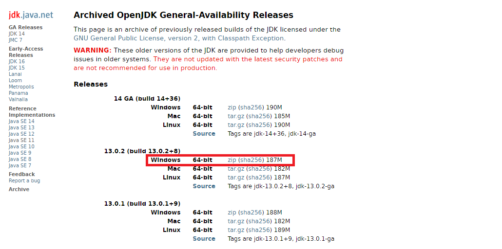
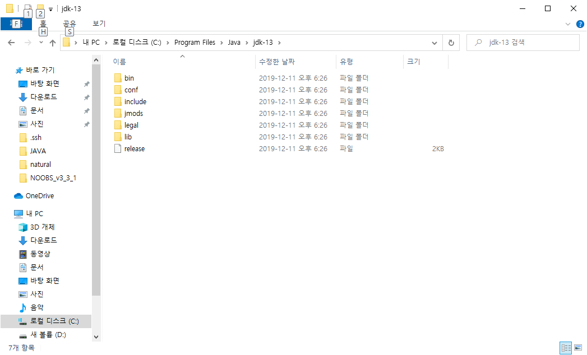
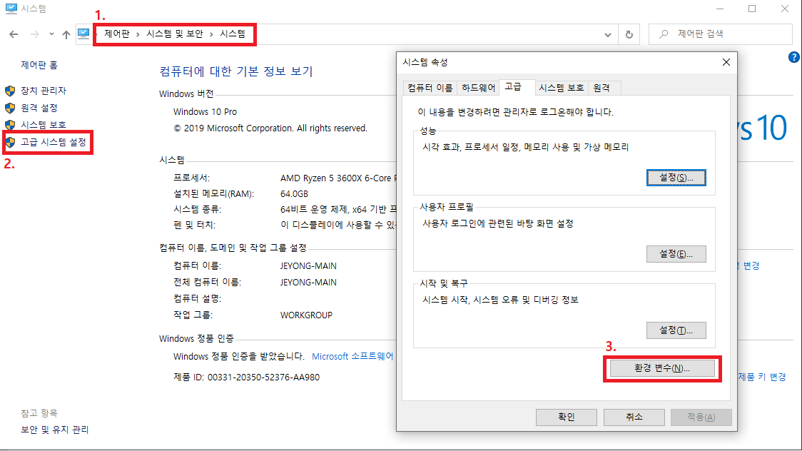
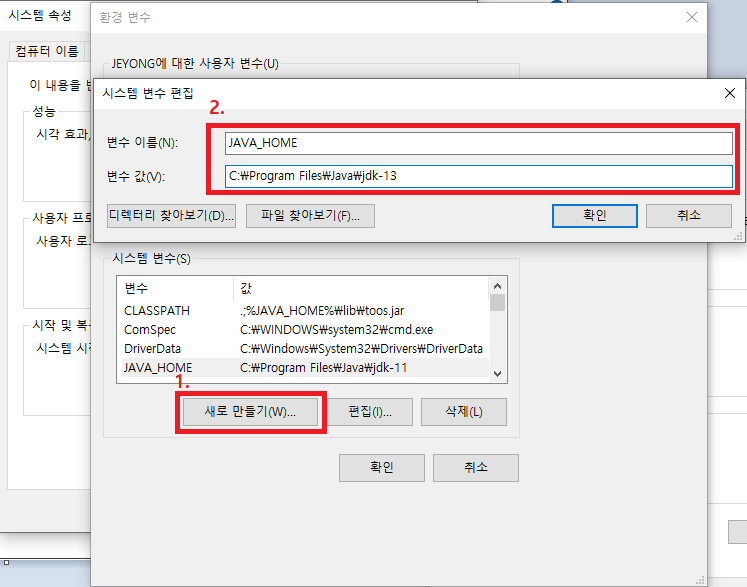
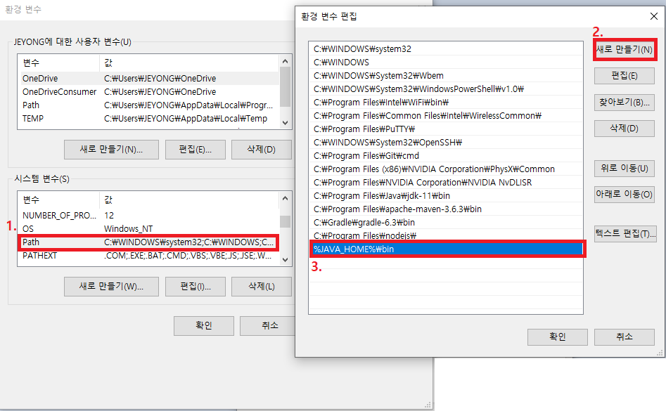
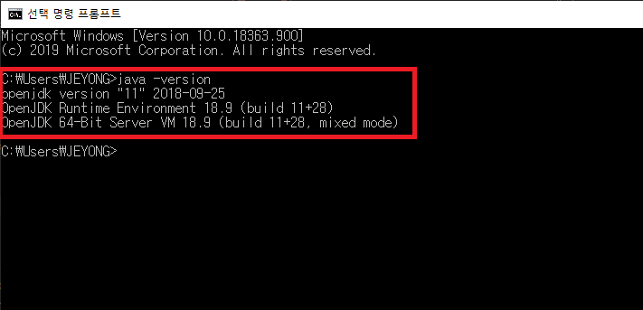

# OpenJDK 설치 방법 (Windows)

## OpenJDK 다운로드



[다운로드 링크](https://jdk.java.net/archive/)에서 Windows 버전 OpenJDK 다운로드

## 압축 해제 및 복사



압축 해제하여 아래 위치에 파일 복사

```bash
C:\Program Files\Java\jdk-13
```

## 환경 변수 및 실행 경로 추가

- 환경 변수 추가





- 실행 경로 추가



## 설치 확인

- 실행 창(`Win` + `R`)에서 `cmd` 실행
- `java -version`으로 설치된 jdk의 버전 정보 확인


