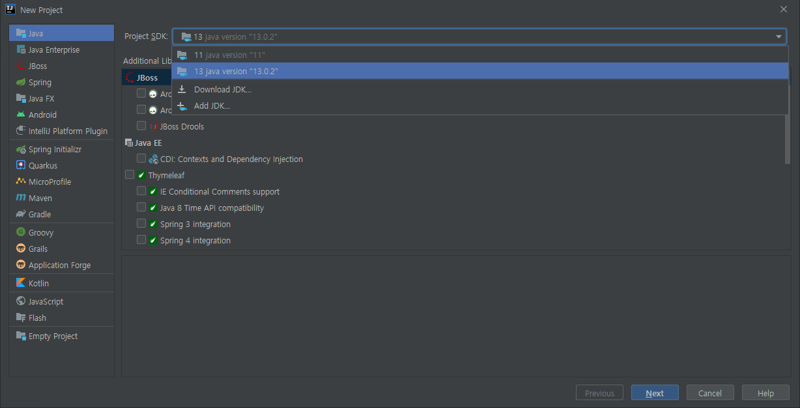
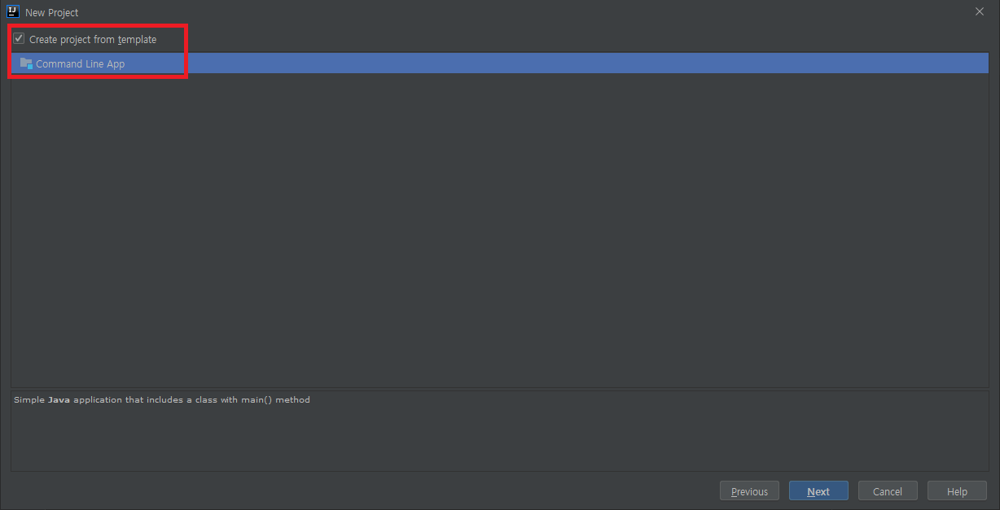
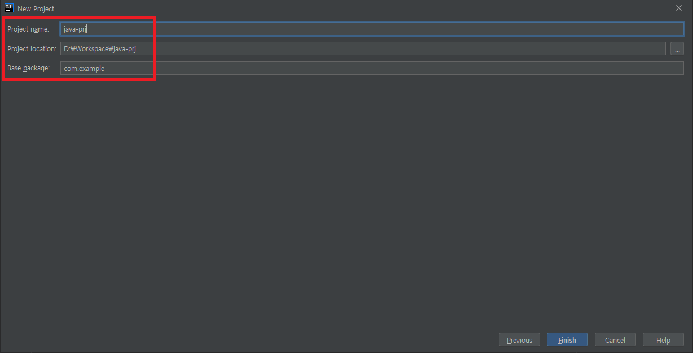
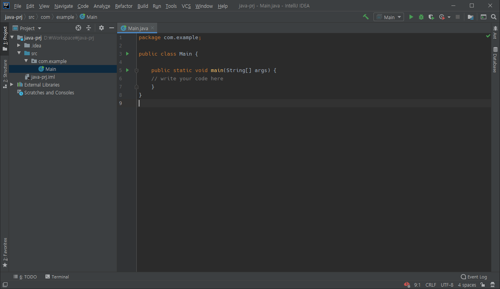
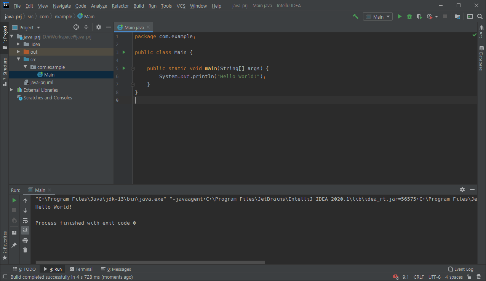

# Java 프로젝트 생성

## IntelliJ에서 프로젝트 생성

1. 설치한 JDK 버전을 선택한다. Download JDK에서 곧바로 설치할 수도 있다.


1. Routine으로 작성되는 부분을 템플릿으로 제공하므로, 이것을 이용한다.


1. 프로젝트명, 프로젝트 위치, 그리고 패키지명을 입력한다. 패키지명은 우선 `com.example`로 한다.


1. 템플릿에 의해 생성된 Main.java 코드는 `src/com.example/`에 위치한다.


1. Hello World 프로그램의 소스코드를 완성한 후 Run 버튼을 누르면 Java Hello World 완성!

```java
System.out.println("Hello World!");
```


