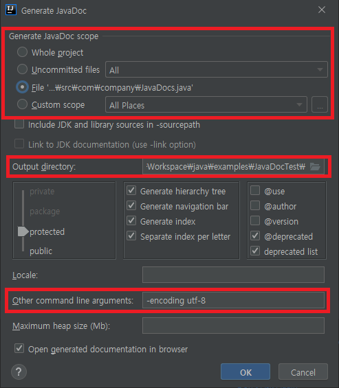

# JavaDoc 주석

## JavaDoc 주석이란

- Java 클래스 및 패키지를 문서화 하기 위한 주석
- 클래스의 용도와 사용법 등을 설명하는 규칙
- 자동으로 JavaDoc 문서를 생성할 수 있음

## JavaDoc 작성 방법

```java
/**
 * Class description
 * @author Author Name
 */
public class ClassA {
    /**
     * Comments for a member variable
     */
    public int memberVar;

    /**
     * Comments for another member variable
     */
    public int secondMemberVar;

    /**
     * Constructor description
     * @param x description for parameter x
     * @param y description for parameter y
     */
    public ClassA(int x, int y) {
        this.memberVar = x;
        this.secondMemberVar = y;
    }

    /**
     * A member method description
     * @param string description for parameter string
     * @return description for the return value
     */
    public int ClassA(String string) {
        return 0;
    }
}
```

## IntelliJ IDEA에서 JavaDoc 생성



- `Tools` -> `Generate JavaDoc...`으로 JavaDoc 생성
- 대상 파일 범위 및 출력 위치 설정
- 한글 지원을 위해 `-encoding utf-8` 인자 전달
